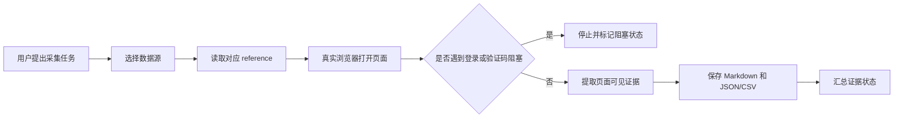

# cross-border-data-capture

跨境电商公开数据采集 Skill，用于指导 Agent 从 Amazon 和 1688 页面采集可复查的商品、评论、图片、供应商、报价、起批量、SKU、包装、物流和跨境属性证据。

这个仓库只保存 Skill 指令和采集流程，不包含爬虫脚本、不包含账号 Cookie、不包含任何私有数据。

## 适用场景

- 采集 Amazon 商品详情、公开评论、A+ 图文、价格、评分、评论数、变体和竞品证据。
- 采集 1688 商品、供应商候选、价格区间、起批量、SKU、包装尺寸、重量、店铺服务分和公司档案。
- 为跨境电商选品、供应商筛选、采购价核验、利润测算和合规前置判断准备证据。
- 同时对比 Amazon 售卖端和 1688 供给端数据。

## 工作流



## 目录结构

```text
.
├── SKILL.md
└── references
    ├── 1688.md
    └── amazon.md
```

## 安装到 Codex

把仓库放到 Codex skills 目录下：

```bash
git clone https://github.com/zeshaoaaa/cross-border-data-capture.git ~/.codex/skills/cross-border-data-capture
```

如果本地已经存在同名目录，先自行备份或合并，避免覆盖已有改动。

## 使用方式

触发跨境电商数据采集任务时，Agent 会先读取 `SKILL.md`，再根据目标数据源按需读取：

- Amazon 任务：`references/amazon.md`
- 1688 任务：`references/1688.md`
- Amazon + 1688 联合任务：两个 reference 都读取

默认原则是先观察真实页面，再提取证据。不要把搜索摘要、模型猜测或不可见字段写成已验证证据。

## 证据边界

允许：

- 公开商品页、搜索结果页、店铺公开页、公司公开档案。
- 用户已授权登录后可见的交易前页面。
- 页面可见文本、图片 URL、本地图片、结构化 JSON/CSV 和 Markdown 汇总。

不允许：

- 访问订单、购物车、支付、收货地址、账号资料、聊天私信等私人页面。
- 绕过验证码、登录墙、Cloudflare、人机挑战或平台风控。
- 伪造销量、库存、认证、价格、供应商资质、物流信息或 MOQ。
- 批量复制完整评论正文。

## 推荐输出

一次任务建议输出到独立目录：

```text
跨境电商数据获取/<task_id>/
├── evidence.json
├── capture-summary.md
├── amazon-products.csv
├── amazon-reviews.csv
├── 1688-suppliers.csv
├── 1688-offers.csv
├── images/
└── videos/
```

## 证据状态

- `verified_evidence`：真实浏览器打开并读取过正文。
- `pending_evidence`：搜索结果、未打开链接、未完整加载页面、仅摘要可见。
- `missing_evidence`：页面没有该字段或当前任务没有提供。
- `blocked_by_login`：登录页阻塞。
- `blocked_by_captcha`：验证码阻塞。
- `blocked_by_browser_challenge`：浏览器授权、风控或人机挑战阻塞。
- `not_visible`：页面打开成功，但字段不可见。

## 缩写说明

- A+：Amazon A+ Content，亚马逊商品详情页里的品牌图文内容。
- MOQ：Minimum Order Quantity，最小起订量。
- SKU：Stock Keeping Unit，库存/商品规格单位。
- CSV：Comma-Separated Values，逗号分隔表格文件。
- JSON：JavaScript Object Notation，结构化数据格式。
